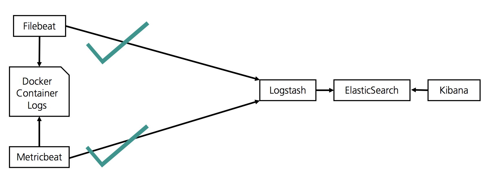
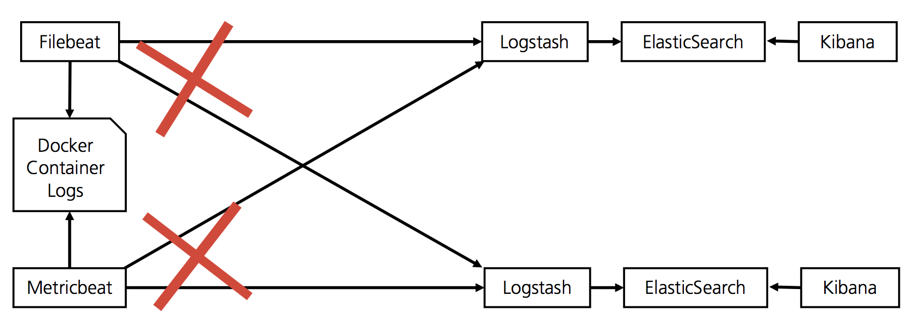
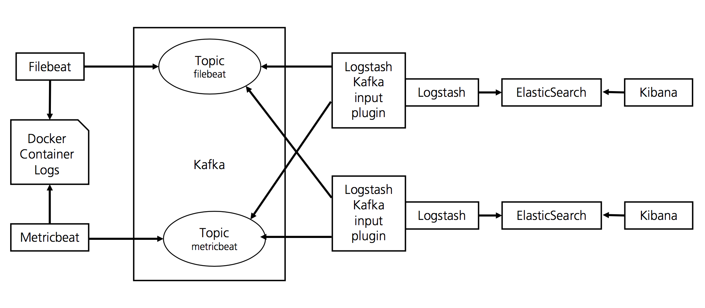

# Elastic Stack & Kafka Docker Monitoring POC

## Setup
- Elasticsearch requires "sudo sysctl -w vm.max_map_count=262144"
- Go into the scripts folder and run ./init.sh
- After that run ./start.sh and wait until the Kibana Dashboard is visible under http://127.0.0.1:5601 (This may take a few minutes)

## To document

### 1

### 2

### 3

